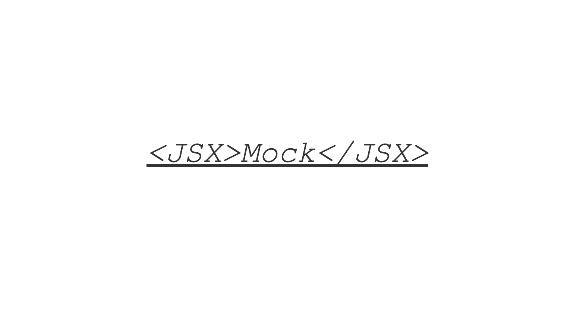

[![NPM version][npm-image]][npm-url]
[![PR's Welcome][pr-welcoming-image]][pr-welcoming-url]

  <!-- [![build status][travis-image]][travis-url]
  [![Test coverage][coveralls-image]][coveralls-url] -->

<br>

jsxmock 是一个简单的 API Mock 服务器。它的特色就是使用 `JSX` 语法来声明 API，这个启发来源于 [Koa](https://github.com/koajs/koa) 和 [React](https://reactjs.org)。通过 jsxmock 你可以更简洁地定义你的 API，我们提供了一些基础组件，如果不能满足你的需求，你可以使用 React 组件开发的思维来封装和组合自己的组件。

<br>

深入了解 jsxmock 可以了解这篇文章: [**JSX AS DSL? 写个 Mock API 服务器看看**](TODO:)

<br>

> **🚧 该项目还处于原型阶段，所有 API 都可能变动，欢迎一起来搞!**

<br>

## 安装

```shell
$ npm i jsxmock --save-dev # 或者 yarn add jsxmock -D
```

<br>

安装后会默认创建一个 jsxmock 命令，你可以用它创建配置文件模板:

```shell
$ npx jsxmock --init # 或者 yarn jsxmock --init
```

`--init` 会在当前目录下创建一个 `.jsxmock.jsx` 文件。如:

```js
/* @jsx h */
import { h, Get, Post } from 'jsxmock'

export default () => (
  <server port="4321">
    <Get>hello world</Get>
    <Get path="/foo" code="400">
      foo
    </Get>
    <Post path="/bar">bar</Post>
  </server>
)
```

<br>

跑起来:

```shell
$ npx jsxmock # 或者 yarn jsxmock
```

jsxmock 默认会使用 `4321` 端口启动服务器。现在你可以访问 `http://localhost:4321` 看看。

另外，你现在可以修改 `.jsxmock.jsx` 文件，jsxmock 会监听文件变动，并自动更新服务器。

<br>

## 使用

### 基本组件

jsxmock 提供了下列基础组件来进行基本的路径和方法匹配:

- `Get` 匹配 HTTP GET 方法
- `Post`
- `Put`
- `Delete`
- `Option`
- `Head`
- `All` 匹配所有方法

<br>

它们使用方式都一样，支持下面这些属性:

- **`path`** 可选，默认为 /。路径匹配基于 [path-to-regexp](https://github.com/pillarjs/path-to-regexp), 可以是字符串、正则表达式、数组等形式。详见 path-to-regexp 文档。
- **`code: number`**: 可选，响应码，默认为 200。
- **`headers: object`**: 可选，HTTP 响应报头。
- **`skip: boolean`**: 可选，用于临时忽略这个条规则
- **`type: string`**: 可选，显式设置 Content-Type，默认会根据发送的类型自动检测。例如字符串默认为 text/html, boolean 和 number 默认为 application/json。
- **`children`**: 响应内容，可以是以下类型:
  - 普通类型，如 string, number, object, Array
  - mock: 支持 [MockJS](http://mockjs.com)
  - 自定义响应函数
  - 其他子组件

<br>

代码示例：

```js
/* @jsx h */
import { h, Get, Post, mock } from 'jsxmock'

export default () => (
  <server port="4321">
    {/* GET / -> 200 hello world */}
    <Get>hello world</Get>
    <Post path="/login">{{ message: 'success' }}</Post>

    {/* 自定义路径、响应代码和报头 */}
    <Get path="/custom-path" code="400" headers={{ 'X-Power-By': 'JSXMOCK' }}>
      {{ custom: 'return json' }}
    </Get>

    {/* 基于 path-to-regexp 的路径匹配 */}
    <Get path="/user/:id" code="202">
      {req => `GET USER ${req.params.id}`}
    </Get>

    {/* 其他响应类型 */}
    <Get path="/custom-type" type="text">
      text/plain
    </Get>
    <Get path="/array">{[1, 2, 3]}</Get>
    <Get path="/buffer">{Buffer.from('buffer')}</Get>
    <Get path="/boolean">{true}</Get>
    <Get path="/number">{1}</Get>

    {/* 支持 mockjs */}
    <Get path="/mockjs">
      {mock({
        'id|+1': 1,
        email: '@email',
        name: '@clast',
      })}
    </Get>

    {/* 自定义响应 */}
    <Get path="/custom-response">
      {(req, res) => {
        res.status(400).send('Bad Request')
      }}
    </Get>

    <Get path="/skip" skip>
      临时跳过
    </Get>
  </server>
)
```

<br>

### 嵌套

jsxmock 组件支持嵌套，规则是只有父组件匹配了，才会进入执行子组件。组件嵌套的特性，可以帮助我们实现更加复杂的需求，例如匹配查询字符串的某个字段:

```js
/* @jsx h */
import { h, Post, MatchBySearch } from 'jsxmock'

export default () => (
  <server>
    <Post path="/myapi">
      <MatchBySearch key="method" value="hello">
        Match By Search: /myapi?method=hello
      </MatchBySearch>
      <MatchBySearch key="method" value="hello">
        Match By Search: /myapi?method=world
      </MatchBySearch>
      <BlackHole>eat everything</BlackHole>
    </Post>
  </server>
)
```

<br>

除了 `MatchBySearch`，我们还内置了下列组件:

- **`MatchByHeader`** 匹配报头字段
- **`MatchByBody`** 匹配 Express req.body
- **`MatchByJSON`** 匹配 JSON
- **`MatchByParams`** 匹配路由变量
- **`MatchByForm`** 匹配表单

<br>
<br>

### 其他

#### 服务器配置

server 组件用于配置 Mock 服务器，目前支持这些属性:

- **`prefix`** API 路径前缀, 可选
- **`port`** 端口号, 可选， 默认是 4321
- **`host`** 主机，可选，默认是 0.0.0.0
- **`https`** 是否开启 HTTPS，可选，默认关闭。开启后将自动创建自签名证书

<br>

#### 延时返回

```js
;<Get path="/delay">
  <Delay timeout={5000}>Delay Delay...</Delay>
</Get>
```

<br>

#### 重定向

```js
;<Get path="/redirect">
  <Redirect to="https://baidu.com" />
</Get>
```

<br>

#### 代理

代理的实现基于 [http-proxy-middleware](https://github.com/chimurai/http-proxy-middleware)

```js
;<Proxy
  path={/^\/proxy/}
  target="http://localhost:4321"
  secure={false}
  logLevel="debug"
  pathRewrite={{ '^/': '/test-proxy/' }}
/>
```

<br>

### 底层组件

可以说，所有的高层组件都是基于 `use` 这个基础组件进一步封装的。跟它的名字一样，use 命名来源于 Koa 的 `app.use`。它有以下两个属性:

- **`skip`** 跳过匹配
- **`m`** 中间件，它的签名如下:

  ```ts
  export type Middleware = (
    req: Request,
    res: Response,
    recurse: () => Promise<boolean>,
  ) => Promise<boolean>
  ```

  - **`req`** Express 的 请求对象
  - **`res`** Express 的响应对象
  - **`recurse`** 递归执行下级组件。 返回一个 `Promise<boolean>`，表示下级中间件是否拦截了请求。如果下级组件执行错误，这里也会抛出异常，可以使用 try/catch 包裹
  - **`返回值`** 返回一个 boolean，表示当前中间件拦截了请求。后续的中间件将不会被执行

<br>

你可以通过[这篇文章](TODO:)了解它的设计思想和基本用法。

<br>

### 封装高层接口协议

#### JSONRPC

```js
;<JSONRPC path="/jsonrpc">
  <JSONRPC.Method name="hello">hello</JSONRPC.Method>
  <JSONRPC.Method name="world">world</JSONRPC.Method>
  <JSONRPC.Method name="echo">{params => params}</JSONRPC.Method>
  <JSONRPC.Method name="mock">
    {mock({
      'name|1-5': 'str',
    })}
  </JSONRPC.Method>
  <JSONRPC.Method name="error">
    {params => {
      throw { message: 'message', code: 123, data: 'error data' }
    }}
  </JSONRPC.Method>
</JSONRPC>
```

<br>

[npm-image]: https://img.shields.io/npm/v/jsxmock.svg?style=flat-square
[npm-url]: https://www.npmjs.com/package/jsxmock
[pr-welcoming-image]: https://img.shields.io/badge/PRs-welcome-brightgreen.svg?style=flat-square
[pr-welcoming-url]: https://github.com/ivan-94/jsxmock/pull/new

## License

[MIT](LICENSE)
